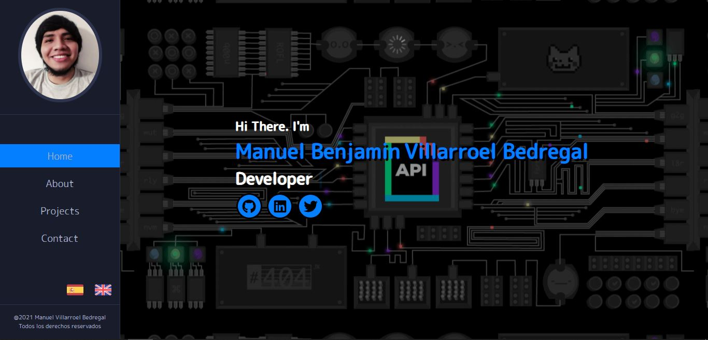
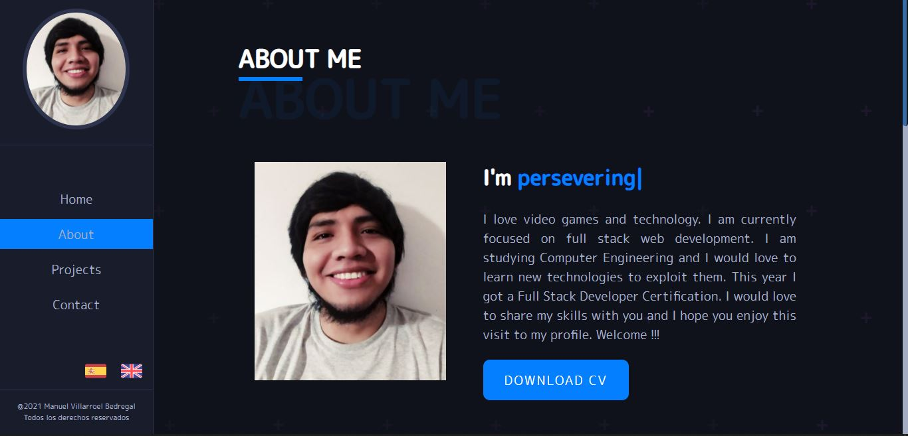
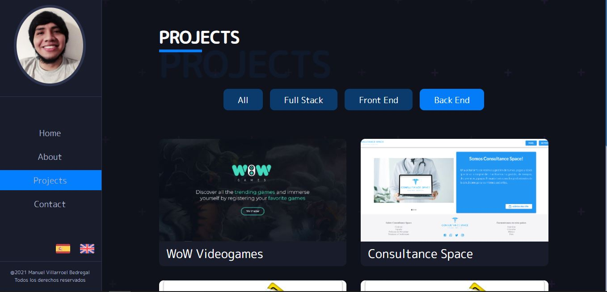
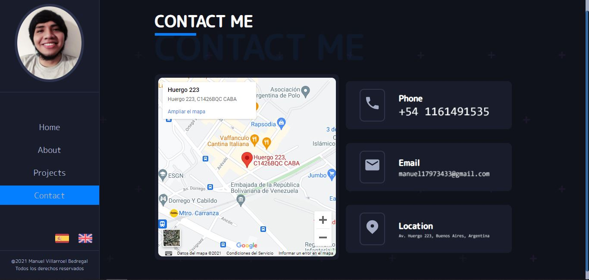

# My PortFolio

## Introduction

It is my portfolio where you can find more information on how to contact me, about my skills, my services and the projects that I have carried out.

## About

Find information about me about projects, skills and professional information.

## Stack of Technologies

### Front End:
HTML, CSS, Javascript, React, SASS.
## **Starting Instructions** 

## BoilerPlate

The boilerPlate has one folder: `Portfolio`.

Front_end_url exp(http://localhost:3000)

## Next 
### _Connect the data base_

 - Go to your postgres database manager and create a new   database. Replace `"data_base_name"` in `.env` file with the name of the new database.

 ### _Install the necesary package to run it_

- Open the project console
    + Run the command line, `npm install` / `yarn install`.
    + After, run the comand line, `npm start` / `yarn start`
# Project Screens 

- Home 

- About

- Projects 

- Contact 

